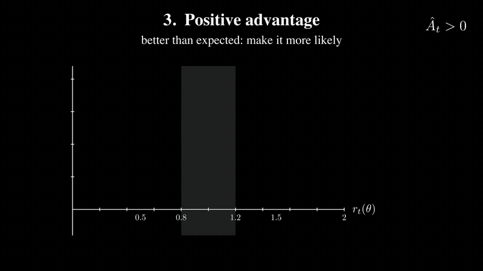
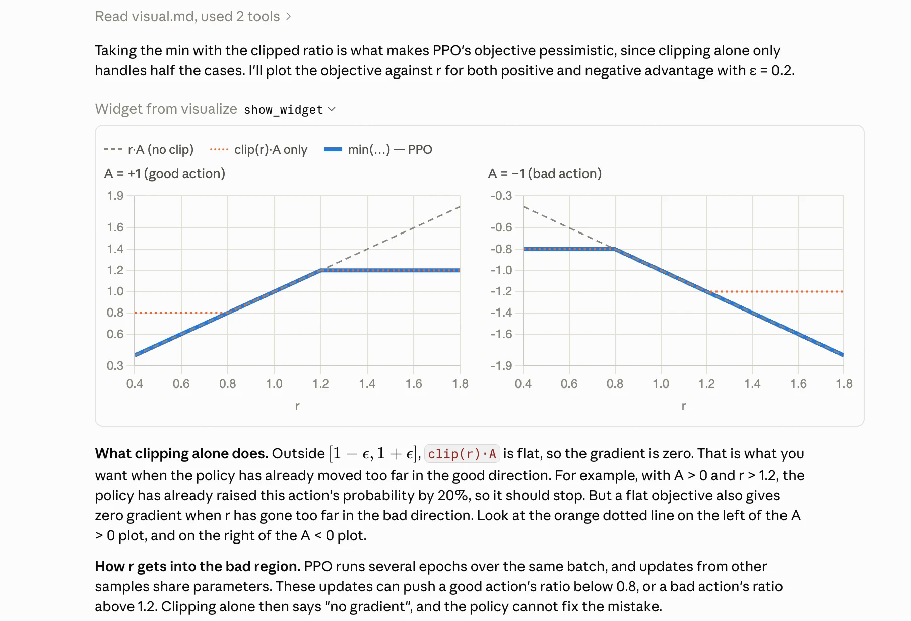
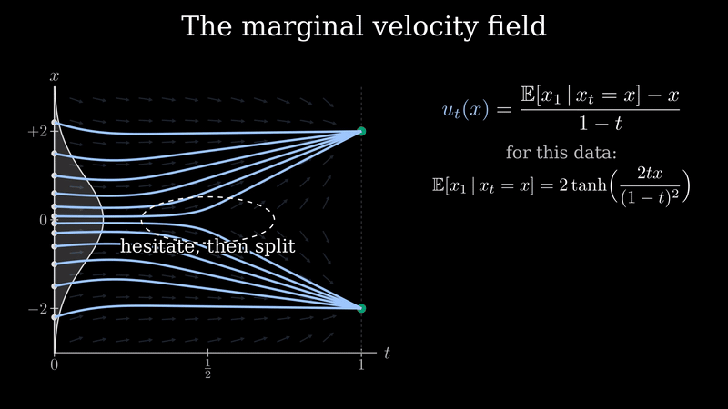
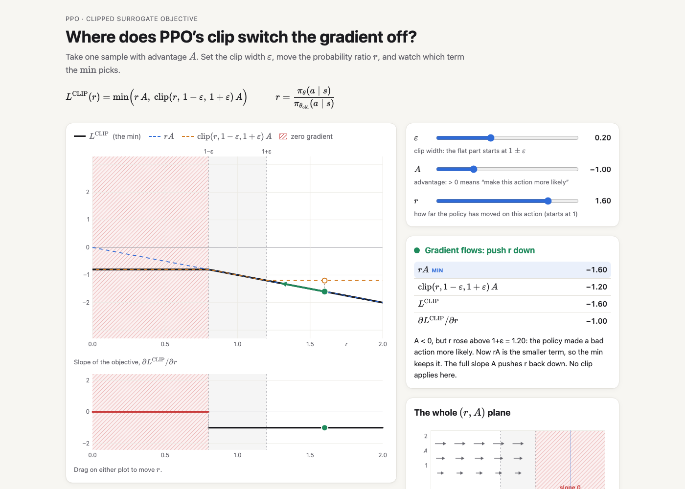
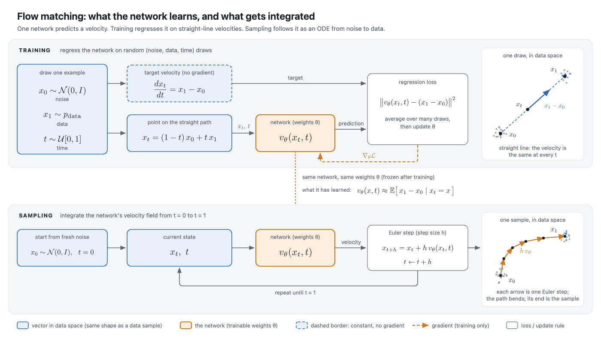
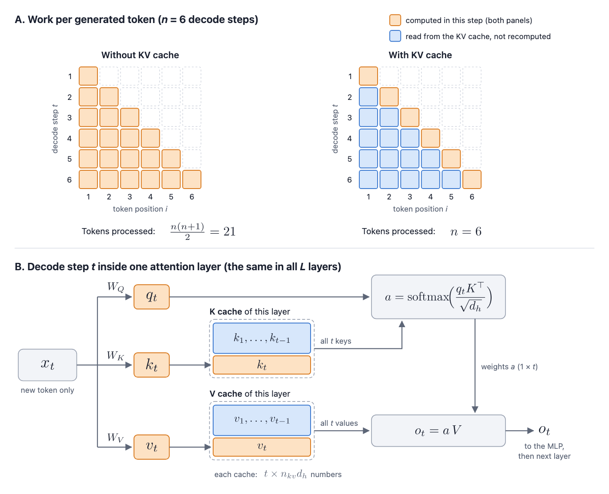

# explainer

A [Claude Code](https://claude.com/claude-code) skill that picks the clearest way to explain something — and then actually builds it: controlled-English text, Mermaid or typeset SVG diagrams, comparison tables, interactive pages, or a narrated 3Blue1Brown-style video. English or Chinese.

It grew out of [Andrej Karpathy's post](https://x.com/karpathy/status/2105819303471976479) on getting LLM output into forms that are easier to understand: ASD-STE100 writing → diagrams → HTML pages → bespoke explainer videos. This skill packages that ladder so the agent chooses the rung (or several) that fits the content, and checks its own visual output before handing it over.

<p align="center">
  <a href="examples/video-ppo-clip/ppo-clip.mp4"></a><br>
  <sub>Click for the full 5-minute video (1080p, narrated). Made end-to-end by Claude with this skill: narration, storyboard, Manim animation, TTS, assembly, frame review.</sub>
</p>

## What it does

| Content looks like… | The skill adds |
|---|---|
| anything | a text answer (always the anchor), written for the audience it infers (expert / novice / non-native) |
| parts and relations, a data flow | a diagram: a Mermaid block when it goes into Markdown (README, PR, Notion), an SVG with LaTeX-typeset formulas otherwise |
| two or three things to compare | a comparison table (only the rows that differ) |
| an ordered exchange, a state machine, a history | a sequence diagram, state diagram, or timeline |
| a continuous process, or something with a knob to turn | an interactive HTML page (KaTeX math, live sliders) |
| something to follow or reproduce exactly | ASD-STE100-style text ("80% STE" by default; concrete rules for Chinese too) |
| a concept worth a video, *and you ask for one* | a narrated Manim video with per-sentence audio/visual sync and subtitles |

Before pixels it checks content: every number recomputed, conventions named, sources cited, the usual mix-ups listed. It also follows the conversation: if you still don't get it, it first locates the sticking point (a term? missing background? the process?) and adds the one thing that fixes it, instead of repeating itself or rebuilding the artifact.

## Conversation mode

Most explaining happens mid-conversation, not as a deliverable. When you ask Claude to explain something, or say you don't get it, and the host can render visuals inside the reply (e.g. the Claude desktop app), the answer itself becomes interleaved text and diagrams. It stays light: at most one or two inline visuals, no separate file; the one answer we timed took about 50 seconds, including the first-time read of the diagram tool's guide. During normal coding work it stays in text and doesn't interrupt.

> *"Why we need min function in PPO's objective?"* (asked in a normal Claude Code desktop session)

<p align="center"></p>

The reply loads the skill's diagram guide, plots the objective for both signs of the advantage, and the text below points into the plot ("the orange dotted line on the left of the A > 0 plot"). An interactive page is offered in one line, not built.

Skills load when the model thinks it needs them. The skill's description now names the conversational triggers directly (why/how questions, "explain", "I still don't get it", and their Chinese equivalents), which is the mechanism Claude Code documents for triggering; `evals/run_triggers.sh` measures it. If plain "why…?" questions still go unanswered by the skill in your setup, one line in `~/.claude/CLAUDE.md` is a workable fallback:

```
- When I ask how or why something works, use the explainer skill to decide whether a diagram belongs in the answer.
```

## Examples

All examples below were produced by Claude Code with this skill from a one-line request. Prompts and full outputs are in [`examples/`](examples/).

### Video — PPO's clipped surrogate objective

> *"Make me a 3b1b-style explainer video on PPO's clipped surrogate objective — why the ratio is clipped, and what the min() does for positive vs negative advantage."*

[▶ ppo-clip.mp4](examples/video-ppo-clip/ppo-clip.mp4) · 5:01 · 8 scenes · subtitles · [narration](examples/video-ppo-clip/script.json) · [storyboard](examples/video-ppo-clip/storyboard.md) · [Manim source](examples/video-ppo-clip/scenes.py)

How it was made: narration first → TTS with sentence timestamps → a per-sentence storyboard → Manim scenes that start each beat on its sentence → 480p draft → one frame per sentence → an independent reviewer agent checks every frame against its sentence (overlaps, math, focus, color meaning) → fixes → 1080p final. In the first run the reviewer caught four text overlaps, the min curve appearing one sentence before the narration introduced it, and red used for two opposite meanings. In the color-blind-safe re-render it caught an on-screen claim that was true only for a positive advantage, a label running off the frame, and a shrunk plot with unreadable labels; all were fixed before the final render, and its second pass verified the fixes ([review log](examples/video-ppo-clip/REVIEW.md)).

### Video — flow matching, built by a fresh agent from scratch

> *"Make me a 3b1b-style explainer video on flow matching: what the network actually learns, why regressing on the per-sample conditional target recovers the marginal velocity field, and how sampling integrates the ODE."*

<p align="center">
  <a href="examples/video-flow-matching/flow-matching.mp4"></a>
</p>

[▶ flow-matching.mp4](examples/video-flow-matching/flow-matching.mp4) · 5:35 · 10 scenes · subtitles · [narration](examples/video-flow-matching/script.json) · [storyboard](examples/video-flow-matching/storyboard.md) · [Manim source](examples/video-flow-matching/scenes.py)

This one was made by a subagent that had only the skill, with no other help. It uses a 1-D toy (data at ±2) so every number can be checked: at t = ½ the two straight-line targets through x = ½ are +3 and −5, the posterior weights are e^−0.5 : e^−4.5, and the marginal field has the closed form (2·tanh(2tx/(1−t)²) − x)/(1−t). Two independent review passes found about two dozen issues ([lists](examples/video-flow-matching/REVIEW.md)), from a rounding slip in the shown arithmetic (0.98·3 + 0.02·(−5) ≠ 2.86) to a narration sentence that was technically wrong; all were fixed before the final render. The 2026-10 color-blind-safe re-render (orange dashed straight paths vs light-blue solid marginal paths, instead of red vs green) went through two more independent passes that rechecked every number and fixed a dozen layout issues. Its weakest scene, by the agent's own rating: "Transport" asserts that the mixture field moves the mixture density instead of showing the mass flow.

### Interactive page — where does PPO's clip switch the gradient off?

> *"I want real intuition for how PPO's clip epsilon and the sign of the advantage shape the clipped objective and where its gradient is zero. Make me something I can play with."*

**[▶ Open the live page](https://yaxin9luo.github.io/explainer-skill/examples/html-ppo-clip/)** — sliders for ε, A, r; drag on the plots; six "try this" cards.

<picture>
  <source media="(prefers-color-scheme: dark)" srcset="examples/html-ppo-clip/screenshot.dark.png">
  
</picture>

Every formula is typeset with KaTeX; the readout and plots are computed live. Before handing it over, the agent screenshotted it in light and dark mode, at true phone width, and in six slider states via URL parameters, and (by its own report) fixed ten problems that way, from a mis-pointing gradient arrow to formulas overflowing on phones. [source](examples/html-ppo-clip/index.html) · [chat answer](examples/html-ppo-clip/answer.md)

### Diagram — flow matching: what is learned vs. what is integrated

> *"Can you draw me a diagram of how flow matching training and sampling fit together? I keep mixing up what the network predicts during training and what gets integrated at sampling time."*

<picture>
  <source media="(prefers-color-scheme: dark)" srcset="examples/diagram-flow-matching/flow_matching.dark.png">
  
</picture>

[SVG](examples/diagram-flow-matching/flow_matching.svg) · [chat answer](examples/diagram-flow-matching/answer.md)

### Text + diagram — the KV cache in ASD-STE100 style

> *"Explain how the KV cache speeds up autoregressive transformer inference, in ASD-STE100 style (80% is fine). I want to be able to re-derive the memory cost myself afterwards."*

The answer leads with the conclusion, then gives the derivation as numbered imperative steps (one action per sentence, ≤ 20 words), so it can be redone by hand:

> 1. For one token in one KV head, count one key and one value. This gives $2 d_h$ numbers.
> 2. Multiply by the KV heads. This gives $2\, n_{kv} d_h$ numbers per token, per layer.
> 3. Multiply by the layers. This gives $2\, L\, n_{kv} d_h$ numbers per token.
> 4. Multiply by the tokens and by the sequences.
> 5. Multiply by the bytes per number.

```math
M_{\text{KV}} = 2 \cdot L \cdot n_{kv} d_h \cdot T \cdot B \cdot b
```

It adds a worked Llama 2 7B example, a self-check on Llama 3 8B (grouped-query attention) with the answer folded away, and, because the content has parts and a flow, one diagram:

<picture>
  <source media="(prefers-color-scheme: dark)" srcset="examples/text-kv-cache/kv-cache.dark.png">
  
</picture>

[full answer](examples/text-kv-cache/answer.md) · [SVG](examples/text-kv-cache/kv-cache.svg). It offered an interactive calculator instead of building one, since the user wanted to do the derivation themselves.

## Install

```bash
git clone https://github.com/Yaxin9Luo/explainer-skill.git
mkdir -p ~/.claude/skills
ln -s "$(pwd)/explainer-skill/explainer" ~/.claude/skills/explainer
```

Text, tables, Mermaid, and interactive pages need nothing else. For **videos**, and for the `math` (typeset formulas in SVG diagrams) and `snapshot` (visual checks) helpers, run the one-time setup:

```bash
bash ~/.claude/skills/explainer/scripts/setup.sh
```

It installs the system libraries it can (Homebrew on macOS; `apt-get` on Debian/Ubuntu when it has root or passwordless sudo, otherwise it prints the exact command), creates a venv at `~/.venvs/explainer` (a Python 3.11–3.13 already on the machine via `uv`, otherwise your `python3`; override with `EXPLAINER_VENV`) with [Manim](https://www.manim.community/) and [edge-tts](https://github.com/rany2/edge-tts), and runs `explainer.py check`, which also reports Chrome, CJK fonts, offline TTS engines, and whether the online TTS host is reachable. On macOS you also need a LaTeX distribution (MacTeX, BasicTeX, or `brew install texlive`); on Linux the apt line includes `texlive texlive-latex-extra`.

Then just ask Claude Code to explain something. Ask for a video explicitly; the skill never starts one unasked.

## How the video pipeline works

```
init ──▶ script.json ──tts──▶ audio/*.mp3 + cues.json (sentence start times; only changed scenes re-synthesized)
              │                         │
              ▼                         ▼
       storyboard.md  ──────▶  scenes.py (Manim; self.cue(i) starts a beat on sentence i, self.finish() holds)
                                        │ render -q l: parallel 480p draft, shared LaTeX cache   ◀── --stale
                               ▼
                   assemble (pad each scene so audio = video; cached parts) ──▶ final.mp4
                               │
                               ▼
     review: one frame per sentence (+ mid-sentence) + contact sheets + index.md
     → self-check + independent reviewer agent → fix → repeat → 1080p
     → srt (subtitles from the cues) → assemble --subtitles → gif (README preview)
```

`scripts/explainer.py` subcommands:

| command | what it does |
|---|---|
| `check` | verify ffmpeg, LaTeX, dvisvgm, manim, edge-tts, Chrome, CJK fonts, offline TTS, and whether the TTS host is reachable |
| `init` | create a project folder: `script.json`, `storyboard.md`, `scenes.py` templates and a `manim.cfg` whose LaTeX cache is shared across projects |
| `render` | render scenes in parallel (one manim process per scene), print each scene's `[timed]` warnings, keep going past a crash; `--stale` renders only what changed |
| `tts` | narration → audio + per-sentence cues; engines: edge-tts (online), espeak-ng (offline), macOS `say`, ElevenLabs. Incremental: only changed scenes, with a diff of the cues. Chinese narration picks a zh-CN voice. Empty narration + `duration` = a silent scene |
| `stale` | list scenes whose class source or cues changed since their video was last assembled/reviewed, with the `manim` command to re-render them |
| `assemble` | mux each scene with its audio (freeze last frame / pad silence), concatenate; unchanged parts are reused; `--subtitles` adds a soft track, `--burn-subtitles` hard-codes it |
| `srt` | sentence-level subtitles from the cues, offset by the real assembly timeline |
| `review` | one frame per sentence (`--mid`: plus mid-sentence, laid out one sentence per row), contact sheets, frame↔sentence index; `--scenes` rebuilds only some |
| `frames` | evenly spaced stills from any video |
| `gif` | palette-optimized GIF preview of a few seconds, for READMEs |
| `lint` | flag sentences over the STE length limit in a Markdown answer (Chinese/Japanese counted in characters; "e.g." does not end a sentence); style notes for missing CJK/Latin spacing and half-width punctuation |
| `math` | LaTeX → SVG sized in px, with `currentColor` and collision-free ids, ready to paste into a diagram |
| `snapshot` | headless-Chrome screenshots of an SVG/HTML page, light + dark (`--sheet` side by side), exact phone width, `--query` for slider states, `--scale 2` / `--transparent` for exports; finds Playwright/snap Chromium or `CHROME_BIN` |
| `voices` | list ElevenLabs voices |

## What I verified, and what I didn't

- Tested on macOS (Apple Silicon) with Claude Code, and the full pipeline (setup, tts, render, assemble, review, srt, gif) on Ubuntu 24.04 with manim 0.21 in a cloud container. Windows is not supported.
- Online TTS (edge-tts), checked on a 3-scene English + Chinese test video behind a TLS-intercepting proxy: edge-tts splits sentences where `explainer.py` does ("e.g.," and "0.2" stay inside a sentence, "。" ends one); every cue lands 0.06–0.2 s before the first word of the right sentence (silence detection on all scenes, plus word timestamps from an offline recognizer on the English ones; the Chinese audio was not transcribed); subtitles in the assembled video start 0.13–0.22 s before the speech, with no drift across scenes. A Chinese scene in an English-voiced script now gets a Chinese voice automatically. Nobody listened to the audio; the checks are timing and transcription only.
- Text, diagram, and page requests were tested with subagents with and without the skill; the video pipeline was tested with the skill only (two videos). Trigger accuracy was measured with `claude -p` on 24 realistic prompts × 3 runs (majority vote), with the CLAUDE.md line above installed: 11 of the 12 should-trigger prompts fired and none of the 12 should-not did. The skill's biggest gains are in the visual forms: typeset math, consistent color encoding, and a screenshot/frame check that catches overlaps, raw `_` subscripts, broken dark mode, and wrong phone layouts before you see them. For plain text, an unaided model already writes good explanations; the skill mostly adds structure (conclusion first, reproducible steps).
- The agent cannot watch a video. Video quality is controlled through per-sentence frames and an independent reviewer, which catches layout, math, and sync-order problems, but not, for example, awkward pacing within a sentence.
- Accessibility: both example videos were re-rendered on 2026-10-05 without any red/green contrast. Their palettes were picked with a deuteranopia/protanopia/tritanopia simulation, and every color also has a second cue (dashed vs solid lines, hatching for zero-gradient regions, marker shapes, labels). Both have sentence-level subtitles (`final.srt`, and an embedded soft track in the mp4).
- edge-tts is free and sends the narration text to Microsoft's online TTS service; the skill says so before running it when the narration looks non-public, and `--engine espeak` is the offline alternative. ElevenLabs works too if `ELEVENLABS_API_KEY` is set (`explainer.py voices` lists voices); its sentence timestamps landed within 0.08 s of the real pauses at the three boundaries we checked (one scene). It sounds more natural but is not needed for clear explainers.
- Both example video projects ship everything needed to re-render them: `script.json`, `storyboard.md`, `scenes.py` (on the shared `timed.py`), the edge-tts `audio/` with its cues, and `final.srt`. From the example folder: `explainer.py render script.json -q h`, then `assemble --quality 1080p30 --subtitles final.srt`.
- Evals: `evals/run_triggers.sh` measures trigger accuracy on 26 prompts (English and Chinese, half should trigger) with `claude -p`; `evals/run_quality.sh` answers 5 fixed prompts with the skill and grades them with a fresh judge session against `references/review.md`, after a preflight that checks the skill text really reaches a `claude -p` session. Both cost model calls; run them after editing `SKILL.md`. Last measured 2026-10-05 in a cloud container (stock Anthropic skills present, no CLAUDE.md line): triggers 13/14 should-fire and 12/12 should-not (2 runs per prompt, majority vote); quality correctness 4.6 / structure 4.0 / form 4.2 out of 5, against 4.2 / 3.6 / 3.6 for the previous rules measured the same way. The rules that moved it: "first sentence = the answer", "no formulas in Mermaid labels" with a wrong/right example, and "still confused → don't re-explain, ask for the sticking point and add one thing", all stated at the top of `SKILL.md`. Remaining judge complaints: comparison tables still carry rows that don't differ, and the PPO question gets neither an inline plot nor an offer of one. Five prompts and one judge are noisy (±0.2 on a mean). Earlier quality numbers, including the 3.2 / 3.2 baseline, measured the bare model: in our Claude Code cloud container, `claude -p` loads a skill that has an `allowed-tools` frontmatter line as empty text (interactive sessions load it fine). The numbers above were measured with that line temporarily removed; `SKILL.md` keeps it, so interactive sessions can run the helper scripts without a prompt. Not checked yet: whether `claude -p` on a local machine has the same problem.

## License

MIT
