## KV cache: how it saves compute, and what it costs in memory

**Short answer.** The KV cache keeps the key and value vectors of all previous tokens, in every attention layer. With the KV cache, each decode step runs the model on the new token only. Without it, each decode step runs the model again on all previous tokens. The KV cache trades GPU memory for this saved compute.

*Diagram file: `kv-cache.svg` (open it with `open kv-cache.svg`). Orange = computed in this step. Blue = read from the KV cache.*

### 1. Why the old keys and values do not change

A decoder-only transformer generates one token per step. In each attention layer, the model computes three vectors for each token $i$:

$$q_i = x_i W_Q, \qquad k_i = x_i W_K, \qquad v_i = x_i W_V$$

Here $x_i$ is the vector of token $i$ at the input of that layer. $W_Q$, $W_K$, and $W_V$ are the weights of that layer.

The causal mask lets token $i$ attend only to tokens $1, \dots, i$. Thus $x_i$, $k_i$, and $v_i$ depend only on tokens $1, \dots, i$. A new token at a later position cannot change them. So the model can compute $k_i$ and $v_i$ one time and keep them.

The model does not keep the other vectors of old tokens:
- **Query $q_i$.** The model uses $q_i$ only to compute the output of token $i$. That output is already done.
- **Hidden states.** The next layers read old tokens only through their keys and values. These are already in the KV cache of each layer.

### 2. One decode step with the KV cache

Generation has two phases:
1. **Prefill.** The model processes the full prompt in one parallel pass. It writes the keys and values of all prompt tokens into the KV cache.
2. **Decode.** The model generates one new token per step.

In decode step $t$, each attention layer does these operations (diagram, part B):
1. Compute $q_t$, $k_t$, and $v_t$ from the new token only.
2. Append $k_t$ to the K cache. Append $v_t$ to the V cache.
3. Compute the attention weights over all $t$ cached keys: $a = \mathrm{softmax}\!\left(q_t K^\top / \sqrt{d_h}\right)$.
4. Compute the output $o_t = aV$. Send $o_t$ to the rest of the layer.

$K$ and $V$ are the cached matrices, with one row per token. $d_h$ is the head dimension. Each attention head does steps 3 and 4 separately, with its own part of $K$ and $V$.

### 3. How much compute the KV cache saves

The KV cache changes the work per step from all tokens to one token (diagram, part A). A forward pass costs about $2P$ FLOPs per token for the weight products. Here $P$ is the number of model parameters. For $n$ generated tokens (prompt not counted):

$$\text{without KV cache: } \sum_{t=1}^{n} 2P\,t \;\approx\; P n^2 \qquad\qquad \text{with KV cache: } 2Pn$$

Thus the KV cache cuts this compute by a factor of about $n/2$.

Two limits apply:
- The attention part still grows with $t$. Step $t$ must read all $t$ cached keys and values.
- The gain in time is smaller than $n/2$. At usual batch sizes, a cached decode step is limited by memory reads (weights and KV cache), not by arithmetic.

### 4. Memory cost: derive it yourself

Count the numbers in the KV cache. Then multiply by the bytes per number. Use these symbols:

| Symbol | Meaning |
|---|---|
| $L$ | number of layers |
| $n_{kv}$ | number of key/value heads (equal to the number of query heads in standard multi-head attention) |
| $d_h$ | head dimension |
| $T$ | tokens in one sequence (prompt + generated) |
| $B$ | number of sequences in the batch |
| $b$ | bytes per number (2 for fp16 or bf16, 1 for fp8) |

Do these steps:
1. For one token in one KV head, count one key and one value. This gives $2 d_h$ numbers.
2. Multiply by the KV heads. This gives $2\, n_{kv} d_h$ numbers per token, per layer.
3. Multiply by the layers. This gives $2\, L\, n_{kv} d_h$ numbers per token.
4. Multiply by the tokens and by the sequences.
5. Multiply by the bytes per number.

The result is:

$$M_{\text{KV}} \;=\; \underbrace{2}_{K,\ V} \cdot \underbrace{L}_{\text{layers}} \cdot \underbrace{n_{kv}\, d_h}_{\text{width per layer}} \cdot \underbrace{T}_{\text{tokens}} \cdot \underbrace{B}_{\text{sequences}} \cdot \underbrace{b}_{\text{bytes}}$$

In standard multi-head attention, $n_{kv} d_h = d_{\text{model}}$. Then each token needs $2\, L\, d_{\text{model}}\, b$ bytes.

**Worked example: Llama 2 7B.** Use $L = 32$, $n_{kv} = 32$, $d_h = 128$, and fp16 ($b = 2$).
- Per token: $2 \cdot 32 \cdot 32 \cdot 128 \cdot 2 = 524{,}288$ bytes $= 0.5$ MiB.
- One sequence of $T = 4096$ tokens: $0.5\ \text{MiB} \times 4096 = 2$ GiB.
- A batch of $B = 8$ such sequences: $16$ GiB. This is more than the weights, which use about 13.5 GB in fp16.

**Check yourself: Llama 3 8B.** This model uses grouped-query attention: 32 query heads share $n_{kv} = 8$ KV heads. The other values are $L = 32$, $d_h = 128$, and bf16. Compute the memory per token. Then compute the memory for one sequence of 8192 tokens.

Answer

$2 \cdot 32 \cdot 8 \cdot 128 \cdot 2 = 131{,}072$ bytes $= 128$ KiB per token. For 8192 tokens: $128\ \text{KiB} \times 8192 = 1$ GiB. Grouped-query attention makes the KV cache $32/8 = 4$ times smaller than full multi-head attention.

---

If you want, I can make an interactive page for this formula. It has one slider per symbol and compares the KV cache size with the weight size.
