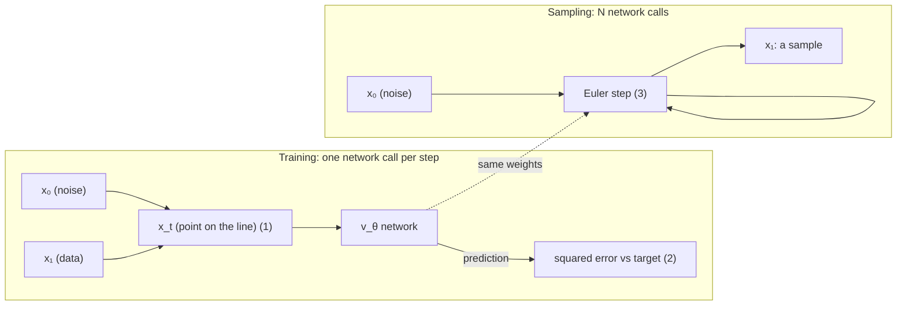

# Mermaid diagrams (for Markdown)

Use Mermaid when the diagram will live in Markdown that renders it — GitHub and GitLab (READMEs, PRs, issues, wikis), Notion, Obsidian, most docs sites — or when the user will paste the diagram somewhere. It is text, so it travels in a chat reply, survives copy-paste, and the user can edit it. Use an SVG (`visual.md`) instead when the diagram needs typeset formulas, exact layout, or is a standalone deliverable.

## Pick the diagram type by the content

| Content | Type | Notes |
|---|---|---|
| pipeline, data flow, module dependencies, call graph | `flowchart LR` (left→right) | `TD` only for hierarchies |
| hierarchy, taxonomy | `flowchart TD` | |
| who sends what to whom, in order (protocol, RPC, request lifecycle, the events behind a race) | `sequenceDiagram` | ≤ 5 participants; payload / status on each arrow; `Note over A,B:` for "this is where it breaks" |
| states and transitions (order lifecycle, connection state, a job's phases) | `stateDiagram-v2` | label every transition with its trigger |
| history, evolution | `timeline` | one line per milestone saying what changed |
| classes / entities and their relations | `classDiagram` / `erDiagram` | real field names, not "attr1" |
| a Gantt or a pie | usually not worth it for an explanation | |

## Rules

- **Real content.** Nodes hold the actual things (`logits [B,T,V]`, `kv_cache.append`, `π_θ`), arrows say what flows (`gradient`, `token ids`). Never "Module A".
- **One reading direction**, ≤ 12 nodes. More → an overview diagram and one zoom-in.
- **Group with `subgraph`** when parts belong together (`subgraph Training`, `subgraph Sampling`).
- **Labels**: ≤ 6 words (≈ 12 characters for Chinese). Quote any label that contains `()`, `[]`, `{}`, `|`, `:` or `;` — `A["clip(r, 1-ε, 1+ε)"]` — or the parser breaks on the brackets.
- **No formulas in labels — not even short ones.** A node or edge label names a thing (`x₀ (noise)`, `v_θ network`, `loss`); it never holds an expression with an operator (`=`, `+`, `−`, `·`, `‖ ‖`, `←`, a fraction). Mermaid cannot typeset math, GitHub does not render LaTeX inside Mermaid labels, and a formula squeezed into a box is unreadable. Single symbols in Unicode are fine (`x₀`, `v_θ`, `∇`, `≤`). Put every formula in a short numbered list directly under the diagram, and refer to it from the label if needed (`loss (1)`).
- **Meaning in shape and style, not just color.** Themes differ per site, and colors can be overridden, so encode with node shapes (`[ ]` process, `( )` data, `{ }` decision, `[( )]` store), arrow styles (`-->` flow, `-.->` optional / no gradient, `==>` the main path), and words. If you add `style`/`classDef` colors, never let red vs green carry a distinction alone.
- **Sequence diagrams**: `activate`/`deactivate` for the lifetime of a call; `alt`/`else` for the two outcomes; `Note over` for the one line that explains the failure.
- **State diagrams**: `[*] --> Idle`; name transitions after their trigger (`Idle --> Running : start()`).

## Check before handing over

`snapshot` cannot render Mermaid, so the check is by reading:
1. Every node name in the text is in the diagram and spelled the same way.
2. No label with unquoted brackets or a `;`, and no label with a formula (an `=`, `+`, `−`, `·`, `‖`, `←`): those go in the numbered list under the diagram.
3. Node count ≤ 12 and one direction.
4. The diagram says one thing the paragraph above it could not say as fast.

Tell the user it was not rendered here and to glance at the preview; if it fails to render, the usual cause is an unquoted bracket in a label.

## Example

Labels name the parts; the formulas they stand for are listed under the diagram.

1. $x_t = (1-t)\,x_0 + t\,x_1$, with $t=0$ noise and $t=1$ data.
2. $\mathcal L = \lVert v_\theta(x_t, t) - (x_1 - x_0)\rVert^2$
3. $x \leftarrow x + h\,v_\theta(x, t)$, from $t=0$ to $t=1$.
